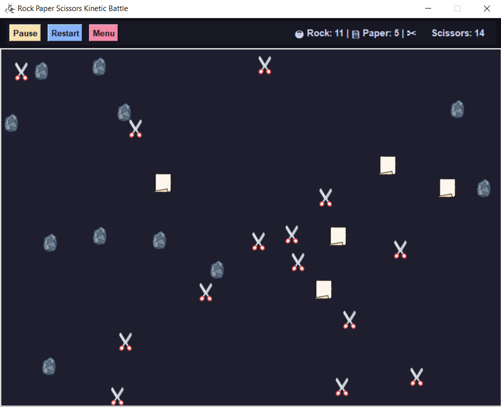
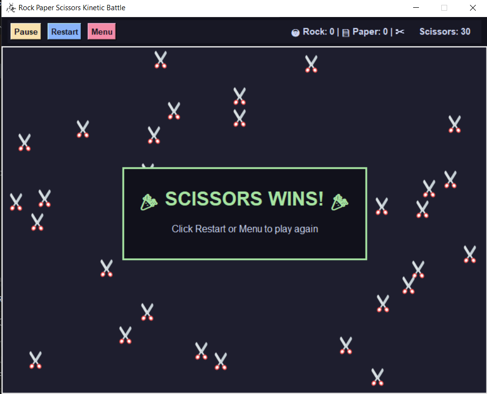

#  Rock Paper Scissors Kinetic Battle Simulation

A dynamic 2D physics-based simulation built in Python using Tkinter and PIL (Pillow). Watch entities move, bounce off canvas boundaries, collide, and convert each other based on classic Rock-Paper-Scissors rules until one entity type achieves total visual dominance!

---

## Gameplay Preview

| Active Battle | Victory Screen |
| :---: | :---: |
|  |  |

---

##  Features

* **Custom Game Setup:** Customize initial spawn counts for Rocks, Papers, and Scissors, as well as adjust entity speeds directly from the launch menu.
* **Elastic Physics & Collision Logic:** Entities bounce off walls and each other realistically while applying conversion rules on impact.
* **Live Scoreboard:** Real-time entity counters track remaining numbers for each type as the battle unfolds.
* **Full Simulation Control:** Pause, resume, restart, or exit back to the main menu at any time.
* **Win Condition Alert:** Automatically detects when two entity types are eliminated and announces the winning type with an on-screen banner.

---

##  Tech Stack & Requirements

* **Python 3.x**
* **Tkinter** (Python's standard GUI library)
* **Pillow (PIL)** for image asset loading and sprite scaling

---

##  Getting Started

### 1. Clone the Repository
```bash
git clone [https://github.com/amine-jelassi7/rock_paper_scissors_kinetic_battle.git](https://github.com/amine-jelassi7/rock_paper_scissors_kinetic_battle.git)
cd rock_paper_scissors_kinetic_battle
